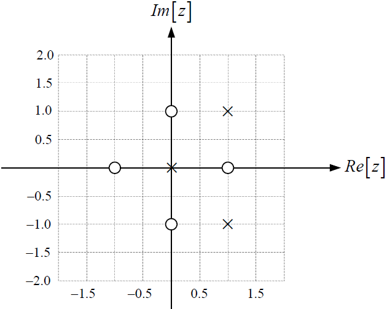

# Funcion de Transferencia
LA funcion de transferencia H(s) es una representacion matematica que relaciona la entrada y la salida de un sistema en el dominio de Laplace. Esto se representa como:

$$ H(s)=\frac{Y(s)}{X(s)}$$

## Laplace
La utilidad de la transformada de laplace en cuanto la funcion de transferencia es la de principalmente simplificar el analisis, tambien permite obtener la respuesta del sistema a travez de la derivada inversa. ademas, permite realizar operaciones algebraicas en lugar de resolver ecuaciones
Estos procesos se realizan por medio de las siguientes propiedades:

Transformada de una funcion:

$$L{f(t)}=F(s)$$

Transformada de la derivada:

$$L(f'(t))=sF(s)-f(0)$$

$$L(f''(t))=s^{2}F(s)-sf(0)-f'(0)$$

Transformada de la integral:

$$L(\int f(t)dt)=\frac{1}{2}F(s)$$

## Ceros de una funcion de transferencia
Este proceso consiste en reemplazar los valores de s con la intencion de que el numerador se vuelva 0. Estos valores pueden ser reales o imaginarios, Estos ceros representan frecuencias en donde la salida del sistema se suprime por completo.
## Polos de una funcion de transferencia
Este proceso es relativamente igual al proceso anterior. sin embargo, en vez de tratar de hacer el numerador 0 se centra en hacer el denominador cero. Esto se realiza para detrminar la estabilidad del sistema.

Si todos los polos tienen parte real negativa el sistema es estable:

$$Re(s)<0$$

Si algun polo tiene parte real positiva el sistema es inestable:

$$Re(s)>0$$

Si los polos son imaginarios el sistema es marginalmente estable:

$$Re(s)=0$$

Finalmente teniendo los ceros y polos del sistema se dispone a representar los valores de s en una grafica de la siguiente manera:

# Ejercicios

## 1. Hallar los polos y los ceros de la siguiente funcion de transferencia:

$$FT=\frac{s(s-2)}{(s+5)(s^{2}+6s+10)}$$

## solucion
Encontramos primero los ceros:

$$s(s-2)=0$$

$$s=0, S=2$$

Despues obtenemos los polos:

$$(s+5)(s^{2}+6s+10)=0$$

$$s_{1}=-5$$

$$s_{2,3}=\frac{-6\pm \sqrt{6^{2}-4(10)}}{2}$$

$$s_{2,3}=\frac{-6\pm \sqrt{36-40}}{2}$$

$$s_{2,3}=\frac{-6\pm \sqrt{-4}}{2}$$

$$s_{2,3}=\frac{-6\pm 2i}{2}$$

$$s_{2,3}=-3\pm i$$

$$s_{2}=-3+ i$$

$$s_{3}=-3- i$$

## 2. Hallar los polos y los ceros de la siguiente funcion de transferencia:

$$G(s)=\frac{s+2}{s(s^{2}+2s+2)}$$

## solucion
Primero se encuentran los ceros:

$$s+2=0$$

$$s=-2$$

