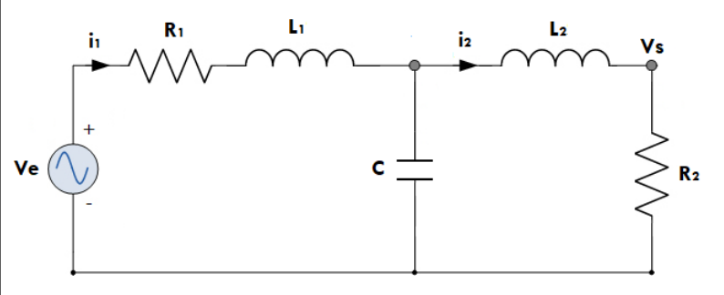

# Modelamiento de sistemas
## Sistema
Conjunto de componentes que actuan en conjunto con el fin de alcanzar un objetivo especifico. Esto se puede representar por medio de pricipios que relacionan entradas y salidas.
## Principio general del modelamiento
$$Tasa de acumulacion \frac {masa}{energia}=flujo de \frac {masa}{energia} entrada-flujo de \frac {masa}{energia} salida$$
## Modelos dinamicos
Normalmente se interesa obtener un modelo matematico en donde las variables de interes esten en funcion del tiempo (F(x)). Normalmente un modelo de ecuaciones diferenciales tiene la siguiente forma:

$$a_{1}\frac{\mathrm{d^{2}}F }{\mathrm{d} t^{2}}+a_{2}\frac{\mathrm{d} F}{\mathrm{d} t}+a_{3}F=u(t)$$

## Sistemas mecanicos
Los sistemas mecanicos usualmente se representa de la siguiente manera:

Estos sitemas estan afectados por los siguientes fenomenos fisicos:

$$F_{r}=k_{2}\cdot x \to Ley de hooke$$

$$F_{F}=k_{1}\cdot V_{m} \to Friccion viscosa$$

$$F=m \cdot a \to Newton$$

## Sistemas rotacionales
Se trata de sistemas los cuales estan afectados por un fenomeno mecanico con la naturaleza de este cambiando convirtiendose en un movimiento angular.
Normalmente se representan de la siguiente forma:

Algunas de las ecuaciones relacionadas a este fenomeno son:

$$F_{R}= k \cdot \varphi \to \varphi = angulo de torsion$$

$$F_{F}= b \cdot \frac{\mathrm{d} \varphi }{\mathrm{d} t} \to \frac{\mathrm{d} \varphi }{\mathrm{d} t} = Velocidad angular$$

$$T= J \cdot \frac{\mathrm{d^{2}} \varphi }{\mathrm{d} t^{2}} \to J = Momento de inercia$$

# Sistemas electricos
## Circuitos RLC

Los fenomenos fisicos que aplican en este tipo de sistemas son:

$$R=\frac{v(t)}{i(t)}\to Ley de ohm$$

$$i(t)=C\frac{\mathrm{d} v(t)}{\mathrm{d} t}\to Carga de un condensador$$

$$v(t)= L \frac{\mathrm{d} i(t)}{\mathrm{d} t}\to Carga de un inductor$$

## Circuitos con amplificadores operacionales

### no inversor 
Algunas de las caracteristicas de este amplificador son:

-La tension en ambas entradas del amplificador tienen el mismo valor

-La corriente en las entradas del amplificador es 0

-La impedancia de la entrada es muy grande y en la salida es muy pequeña

## Sistemas hidraulicos

Se tratan de sistemas industriales en se quiere controlar el flujo o nivel en un tanque. 
Algunas de las ecuaciones referentes a estos sistemas son:

$$q_{1}=\frac{h_{1}}{R_{1}}$$

$$A_{1} \frac{\mathrm{d} h_{1}}{\mathrm{d} t}=q_{i}-q_{1}$$

en donde:

qi,qo: Flujos de entrada y salida

R1: resistencia al flujo

A1: Area trasnversal del tanque

h1: Nivel de liquido en el tanque

# Ejercicios
1.

  

  $$i_{L}=i_{R}+i_{C}$$

  $$V_{L}=L\frac{\mathrm{d} i_{L}}{\mathrm{d} t}$$

  $$i_{C}=C\frac{\mathrm{d} V_{C}}{\mathrm{d} t}$$

  $$V_{R}=Ri_{R}$$

  $$V=V_{L}+V_{C}$$

  $$V=L\frac{\mathrm{d} i_{L}}{\mathrm{d} t}+V_{C}$$

  $$i_{L}=i_{R}+i_{c}\to i_{L}=\frac{V_{c}}{R}+C\frac{\mathrm{d} V_{c}}{\mathrm{d} t}$$

  2.
  

$$i_{L}=i_{R}+i_{C}$$

$$V_{L}=L\frac{\mathrm{d} i_{L}}{\mathrm{d} t}$$

$$i_{C}=C\frac{\mathrm{d} V_{C}}{\mathrm{d} t}$$

$$V_{R}=Ri_{R}$$

kirchoff en la primera maya:

$$V_{c}=R_{1}i_{1}+L_{1}\frac{\mathrm{d} i_{1}}{\mathrm{d} t}+V_{c}$$

kirchoff en la segunda maya:

$$i_{1}=i_{2}+i_{c}$$

$$V_{c}=L_{2}\frac{\mathrm{d} i_{2}}{\mathrm{d} t}+R_{2}i_{2}$$

3.

$$M_{1}\frac{\mathrm{d} v_{1}}{\mathrm{d} t}=F-f_{2}$$

$$M_{2}\frac{\mathrm{d} v_{2}}{\mathrm{d} t}=f_{2}-kx_{2}$$

$$v_{2}=\frac{\mathrm{d} x_{2}}{\mathrm{d} t}$$

$$f_{2}=b(v_{2}-v_{1})$$

Se aplica Laplace:

$$M_{1}sV_{1}(s)=F(s)-b(V_{2}(s)-V_{1}(s))$$

$$M_{2}sV_{2}(s)=b(V_{2}(s)-V_{1}(s))-\frac{k}{s}V_{2}(s)$$

4. Realizar el modelamiento del siguiente sistema:

$$M\frac{\mathrm{d^{2}} x}{\mathrm{d} t^{2}}=F-f\frac{\mathrm{d} x}{\mathrm{d} t}-kx$$

$$M\frac{\mathrm{d^{2}} x}{\mathrm{d} t^{2}}+f\frac{\mathrm{d} x}{\mathrm{d} t}+kx=F$$

Aplicamos Laplace:

$$Ms^{2}X(s)+fsX(s)+kX(s)=F(s)$$

$$X(S)(Ms^{2}+fs+k)=F(s)$$
