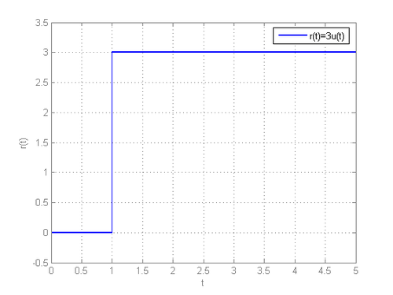
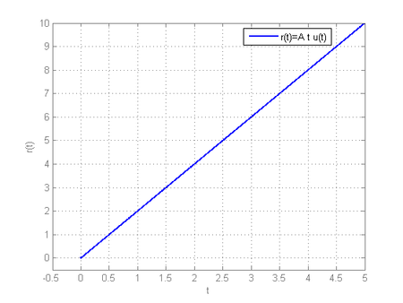
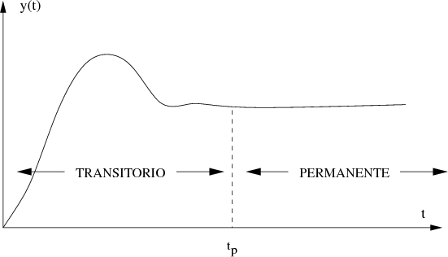

# Sistemas de primer orden
## Introduccion
Los sistemas de primer orden se modelan por medio de ecuaciones diferenciales de primer orden y son esenciales en el análisis de sistemas de control. Nos permiten estudiar la respuesta ante diferentes tipos de entradas, como escalón, rampa e impulso. Este informe aborda temas como la transformada de Laplace, la función de transferencia y las respuestas temporales de estos sistemas.
## Transformada de Laplace
La transformada de Laplace es una herramienta matemática que convierte ecuaciones diferenciales del dominio del tiempo a ecuaciones algebraicas en el dominio de la frecuencia compleja esto nos facilita el análisis de sistemas dinámicos. La transformada de Laplace de una función f(t) se define como:

$$L\[f(t)]=F(s) $$

## 2. Respuesta Temporal de Sistemas de Primer Orden

### 2.1. Respuesta al Escalón

La respuesta de un sistema de primer orden ante una entrada escalón $$u\(t) = \frac{A}{s}$$ se puede obtener aplicando la transformada de Laplace. La salida en el dominio de Laplace es:

$$Y(s) = \frac{AK}{s(\tau s + 1)}$$

Aplicando fracciones parciales y la transformada inversa de Laplace, se obtiene la respuesta en el tiempo:

$$y(t) = AK(1 - e^{-\frac{t}{\tau}})$$

Esta ecuación muestra que la respuesta al escalón tiene un comportamiento exponencial, donde el sistema alcanza el estado estacionario después de un tiempo determinado por la constante de tiempo $$\( \tau \)$$.

### 2.2. Respuesta a la Rampa

Para una entrada rampa $$\( u(t) = At \)$$, la salida en el dominio de Laplace es:

$$Y(s) = \frac{AK}{s^2 (\tau s + 1)}$$

Desarrollando las fracciones parciales y aplicando la transformada inversa de Laplace, se obtiene:

$$y(t) = AK \left( t - \tau + \tau e^{-\frac{t}{\tau}} \right)$$

La respuesta a la rampa también tiene un comportamiento exponencial, pero en este caso, la salida no está acotada por un valor constante, sino que crece linealmente con el tiempo.

### 2.3. Respuesta al Impulso

La respuesta de un sistema de primer orden ante una entrada impulso $$\( \delta(t) \)$$ se obtiene aplicando la transformada de Laplace. La salida en el dominio de Laplace es:

$$Y(s) = \frac{AK}{\tau s + 1}$$

Aplicando la transformada inversa de Laplace, se obtiene la respuesta en el tiempo:

$$y(t) = \frac{AK}{\tau} e^{-\frac{t}{\tau}}$$

Esta respuesta muestra que el sistema tiene un decaimiento exponencial después de un impulso, lo que indica que el sistema disipa la energía rápidamente.

### Entrada parabola

Esta entrada  considera una variacion no lineal en el tiempo lo cual permitira evaluar las condiciones de inicio y final, normalmente se representa como la siguiente expresion:

$$L(r[t])=\frac{A}{s^{3}}$$

## Ejercicio

Dada la siguiente ecuación diferencial de primer orden:

$$2 \frac{dy(t)}{dt} + 4y(t) = 3u(t)$$

Encuentra la función de transferencia $$\(\frac{Y(s)}{U(s)}\)$$.

## Solución

Aplicamos la transformada de Laplace a ambos lados de la ecuación diferencial:

$$\mathcal{L}\{2 \frac{dy(t)}{dt} + 4y(t)\} = \mathcal{L}\{3u(t)\}$$

Usamos la linealidad de la transformada de Laplace:

$$2\mathcal{L}{\frac{dy(t)}{dt}\} + 4\mathcal{L}\{y(t)\} = 3\mathcal{L}\{u(t)\}$$

Aplicamos la transformada de Laplace a cada término:

$$2(sY(s) - y(0)) + 4Y(s) = 3U(s)$$

 Asumimos condiciones iniciales nulas $$(\(y(0) = 0\))$$:

$$2sY(s) + 4Y(s) = 3U(s)$$

Despejamos la función de transferencia $$\(\frac{Y(s)}{U(s)}\)$$:

$$\frac{Y(s)}{U(s)} = \frac{3}{2s + 4}$$

Simplificamos la expresión:

$$\frac{Y(s)}{U(s)} = \frac{3}{2(s + 2)}$$

Por lo tanto, la función de transferencia es:

$$\boxed{\frac{Y(s)}{U(s)} = \frac{3}{2(s + 2)}}$$

## Ejercicio 2
Un sistema de primer orden tiene una respuesta al impulso dada por:

$$y(t) = 4e^{-t/3}$$

- Encuentra la función de transferencia del sistema.

- Determina la constante de tiempo τ y la ganancia estática K.

### Solución
Función de transferencia:

La respuesta al impulso $$\( y(t) \)$$ de un sistema de primer orden tiene la forma:

$$y(t) = K \cdot \frac{1}{\tau} e^{-t/\tau}$$

Comparando con la respuesta dada:

$$4e^{-t/3} = K \cdot \frac{1}{\tau} e^{-t/\tau}$$

Identificamos:

$$K \cdot \frac{1}{\tau} = 4 \quad \text{y} \quad \tau = 3$$

Por lo tanto, la ganancia estática $$\( K \)$$ es:

$$K = 4 \cdot \tau = 4 \cdot 3 = 12$$

La función de transferencia $$\( G(s) \)$$ de un sistema de primer orden es:

$$G(s) = \frac{K}{\tau s + 1}$$

Sustituyendo los valores de $$\( K \) y \( \tau \)$$:

$$G(s) = \frac{12}{3s + 1}$$

Constante de tiempo $$\( \tau \)$$ y ganancia estática $$\( K \)$$:

$$\tau = 3 \quad \text{y} \quad K = 12$$

