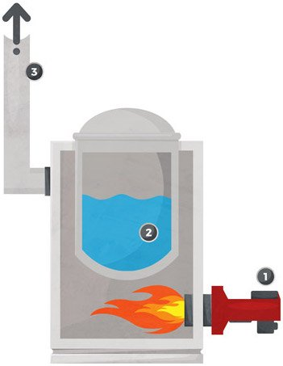
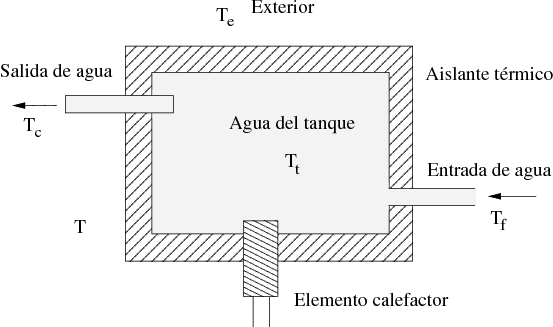
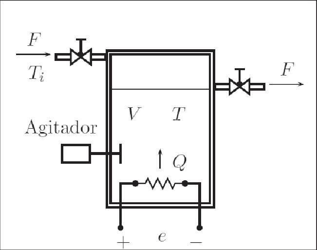

# Sistemas Termicos y combinaciones
Daniel Felipe Ladino, Angel David Melo
## Sistenas termicos
### Introduccion 
Los sistemas térmicos son aquellos que implican la transferencia de calor entre componentes, como líquidos fríos y calientes. Su modelado es crucial para predecir su comportamiento dinámico, y se representa mediante ecuaciones diferenciales que describen cómo cambia la temperatura en función del tiempo y las propiedades térmicas de los materiales.

En los sistemas termicos simples se pueden llegar a utilizar las siguientes formulas:

$$R=\frac{\theta }{h_{o}}$$

$$Cd\theta =(h_{i}-h_{o})dt$$

$$RC\frac{\mathrm{d} \theta }{\mathrm{d} t}+\theta =R h_{i}$$

## Potenciometro

Los potenciómetros son dispositivos que permiten variar la resistencia de manera manual o automática. Se utilizan en sistemas de control para ajustar señales de voltaje o corriente. Existen dos tipos principales de potenciómetros: de rotación y de translación.

.jpg)

### tipos de potenciometros

-de rotacion:

$$V_{o}=\frac{\theta }{\theta _{max}}V_{cc}$$

-de translacion:

$$V_{o}=\frac{x}{x _{max}}V_{cc} $$

## Tacometros

Los tacómetros son dispositivos que convierten la velocidad a un voltaje. Son normalmente utilizados en sistemas de control para medir la velocidad de rotación de motores y otros dispositivos mecánicos.

$$v(t)=k\frac{\mathrm{d} \theta (t)}{\mathrm{d} t}$$

## Sensores transmisores

Los sensores transmisores son dispositivos que convierten una variable física (como temperatura, presión, etc.) en una señal eléctrica. Estos sensores pueden ser lineales o no lineales, y su comportamiento se modela mediante ecuaciones diferenciales.

-si son lineales:

$$TO=PV\cdot K$$

-Si no son lineales:

$$a\frac{\mathrm{d} (TO)}{\mathrm{d} t}+b\cdot TO=PV$$
# ejercicios 

1.Realizar el modelamiento del siguiente sistema termico:

$$Q_{i}=FC_{p}T_{f}$$

$$Q_{o}=FC_{p}T_{t}$$

$$Q_{p}=UA(T_{t}-T_{e})$$

$$Q_{c}=Q$$

$$Q_{c}+Q_{i}-Q_{o}-Q_{p}=\frac{\mathrm{d} }{\mathrm{d} t}(mC_{p}T_{t})$$

$$FC_{p}T_{f}-fC_{p}T_{t}+Q-UA(T_{c}-T_{e})=\frac{\mathrm{d} }{\mathrm{d} t}(mC_{p}T_{t})$$

$$FT_{f}-fT_{t}+\frac{Q}{C_{p}}-\frac{UA}{C_{p}}(T_{c}-T_{e})=\frac{\mathrm{d} T_{t}}{\mathrm{d} t}M$$

$$\frac{F}{M}(T_{f}-T_{t})+\frac{Q}{MC_{p}}-\frac{UA}{MC_{p}}(T_{c}-T_{e})=\frac{\mathrm{d} T_{t}}{\mathrm{d} t}$$

2. Modelar el siguiente sistema termico:

$$pc_{p}V\frac{\mathrm{d} T}{\mathrm{d} t}=Fpc_{p}(T_{i}-T_{o})+Q$$

$$\frac{\mathrm{d} T}{\mathrm{d} t}=\frac{F}{V}(T_{i}-T_{o})+\frac{Q}{pc_{p}V}$$

Aplicamos Laplace:

$$sT(s)=\frac{F}{V}T(s)-\frac{F}{V}T_{i}(s)+\frac{Q(s)}{pc_{p}V}$$
